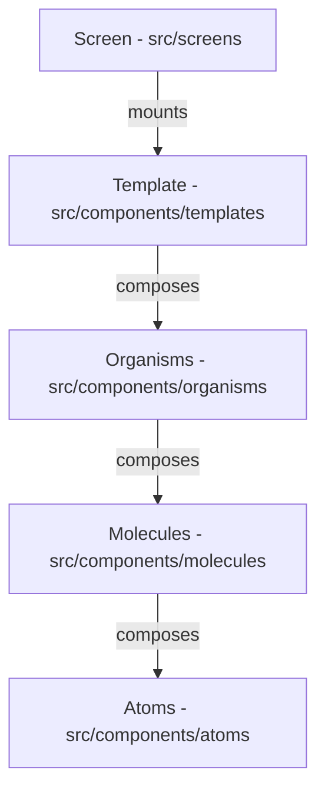

# System Architecture Reference

This document describes the design layers, architectural guidelines, state management patterns, and service integration for the repository.

---

## 🏗️ Architectural Pattern: Logic-Free UI & Atomic Design

We strictly enforce **Atomic Design** combined with **SOLID principles**, isolating all UI rendering from business logic.



### Component Responsibility
* **UI File (`ComponentName.tsx`)**: Strictly visual structure. It consumes handlers and values from the logic hook and outputs layout. Must be wrapped in `React.memo` to optimize rendering.
* **Logic Hook (`useComponentName.ts`)**: Custom hook enclosing states, Formik validation, animation triggers, and API calls. Zero JSX is allowed inside the hook.
* **Styles File (`ComponentName.styles.ts`)**: Hosts `styled-components/native` declarations referencing the theme variables and scaling utils.
* **Barrel Export (`index.ts`)**: Exports the component and prop types for clean reference.

---

## ⚙️ State Management (Zustand)

Global states are managed using **Zustand** stores stored in `src/store/`:
* **Location Store (`useLocationStore.ts`)**: Manages start, destination, and user current location.
* **Auth Store (`useAuthStore.ts`)**: Handles credentials, tokens, and active profiles.
* **Ride Publish Store (`useRidePublishStore.ts`)**: Coordinates publishing a ride (stops, pricing, dates, seats).
* **Book Ride Store (`useBookRideStore.ts`)**: Orchestrates the ride booking steps.
* **Chat Store (`useChatStore.ts`)**: Manages active messaging, contacts, and message history.
* **Vehicle Store (`useVehicleStore.ts`)**: Manages the user's vehicles list.

### Selector Pattern (Strictly Enforced)
To prevent components from re-rendering on unrelated store state updates, components must subscribe to specific state slices:
```typescript
// ✅ CORRECT - Subscribes to single state slice
const user = useAuthStore((s) => s.user);
const setToken = useAuthStore((s) => s.setToken);

// ❌ INCORRECT - Subscribes to the entire store (will cause re-renders on any store update)
const store = useAuthStore();
```

---

## 🌐 Services & Networking Layer

All HTTP/REST requests are executed via central services under `src/serviceManager/` utilizing an Axios-based client:

* **Central Client (`axiosClient.ts`)**: Configures the base URL, headers, and request/response interceptors (logging, camelCase conversion, token injections).
* **Domain Services**:
  - `AuthService.ts`: User authentication, Truecaller integration, and registration.
  - `RideService.ts`: Searching, booking, publishing, and retrieving rides.
  - `UserService.ts`: Managing driver reviews, user profiles, and stats.
  - `LocationService.ts`: Fetching stop lists, route geometry, and map directions.
  - `ChatService.ts`: Socket communication, message logs, and chat lists.
  - `NotificationService.ts`: Remote notifications registration.

### Centralized Execution Rule
* Never call Axios or fetch directly in components or logic hooks.
* Always define and call API endpoints inside a service class (e.g. `AuthService.login(...)`) and await the promise in your logic hooks.
